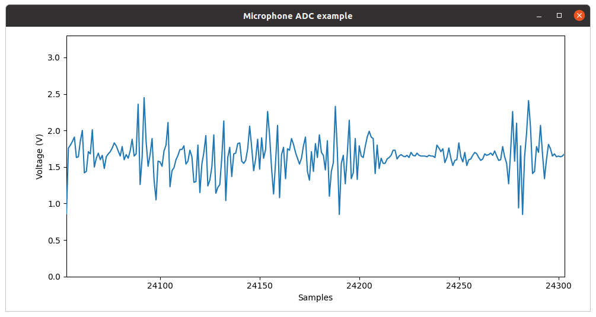
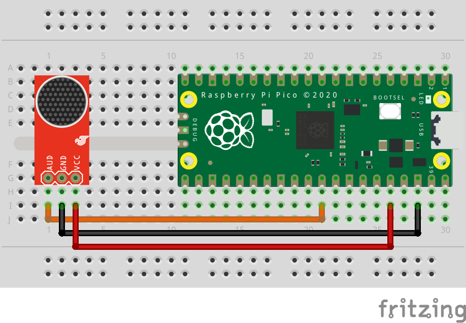

= Attaching a microphone using the ADC

This example code shows how to interface the Raspberry Pi Pico with a standard analog microphone via the onboard analog to digital converter (ADC). In this example, we use an ICS-40180 breakout board by SparkFun but any analog microphone should be compatible with this tutorial. SparkFun have https://learn.sparkfun.com/tutorials/mems-microphone-hookup-guide[written a guide] for this board that goes into more detail about the board and how it works.

[TIP]
======
An analog to digital converter (ADC) is responsible for reading continually varying input signals that may range from 0 to a specified reference voltage (in the Pico's case this reference voltage is set by the supply voltage and can be measured on pin 35, ADC_VREF) and converting them into binary, i.e. a number that can be digitally stored.
======

The Pico has a 12-bit ADC (ENOB of 8.7-bit, see https://datasheets.raspberrypi.com/rp2040/rp2040-datasheet.pdf[RP2040 datasheet section 4.9.3 for more details]), meaning that a read operation will return a number ranging from 0 to 4095 (2^12 - 1) for a total of 4096 possible values. Therefore, the resolution of the ADC is 3.3/4096, so roughly steps of 0.8 millivolts. The SparkFun breakout uses an OPA344 operational amplifier to boost the signal coming from the microphone to voltage levels that can be easily read by the ADC. An important side effect is that a bias of 0.5*Vcc is added to the signal, even when the microphone is not picking up any sound.

The ADC provides us with a raw voltage value but when dealing with sound, we're more interested in the amplitude of the audio signal. This is defined as one half the peak-to-peak amplitude. Included with this example is a very simple Python script that will plot the voltage values it receives via the serial port. By tweaking the sampling rates, and various other parameters, the data from the microphone can be analysed in various ways, such as in a Fast Fourier Transform to see what frequencies make up the signal.

[[microphone_adc_plotter_image]]
[pdfwidth=75%]
.Example output from included Python script

== Wiring information

Wiring up the device requires 3 jumpers, to connect VCC (3.3v), GND, and AOUT. The example here uses ADC0, which is GP26. Power is supplied from the 3.3V pin.

WARNING: Most boards will take a range of VCC voltages from the Pico's default 3.3V to the 5 volts commonly seen on other microcontrollers. Ensure your board doesn't output an analogue signal greater than 3.3V as this may result in permanent damage to the Pico's ADC.

[[ics-40180-adc_wiring]]
[pdfwidth=75%]
.Wiring Diagram for ICS-40180 microphone breakout board.

== List of Files

CMakeLists.txt:: CMake file to incorporate the example in to the examples build tree.
microphone_adc.c:: The example code.

== Bill of Materials

.A list of materials required for the example
[[ics-40180-adc-bom-table]]
[cols=3]
|===
| *Item* | *Quantity* | Details
| Breadboard | 1 | generic part
| Raspberry Pi Pico | 1 | https://www.raspberrypi.com/products/raspberry-pi-pico/
| ICS-40180 microphone breakout board or similar | 1 | https://www.sparkfun.com/products/18011[From SparkFun]
| M/M Jumper wires | 3 | generic part
|===

