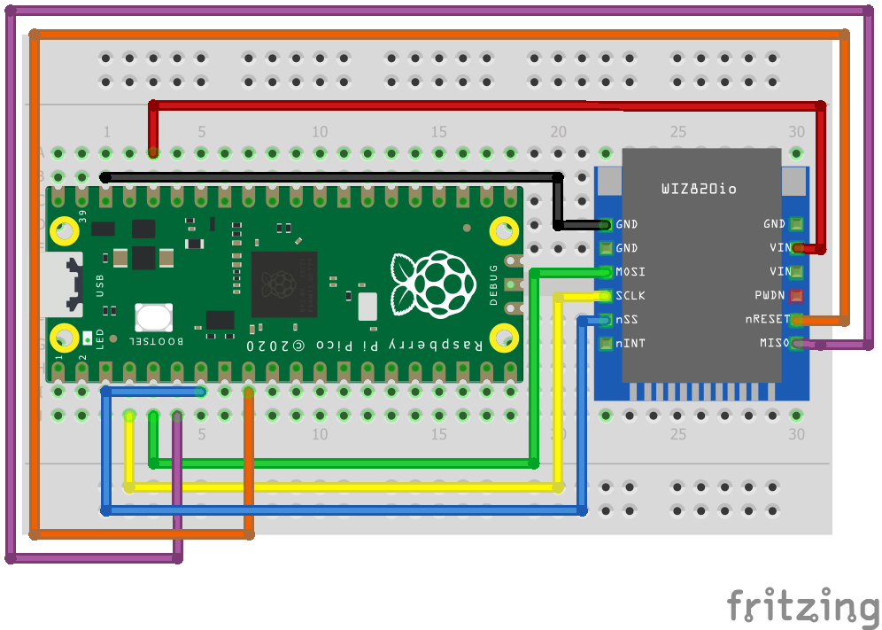

= Attaching a W5500 via SPI

This example code shows how to interface the Raspberry Pi Pico to the W5500 chip. It is interfaced via SPI and power is supplied by the 3.3V pin.

[NOTE]
======
This example simply sends and receives data from the W5500 chip using the polling approach. After you finish using the communication command* on the WIZ850io, ensure then the communication command set to clear.

*The communication command is S"n"_CR (with "n" being the socket number).
======

== Importing external libraries

The libraries required for this example are added to the .gitmodules file as a submodule and are imported automatically. 

The structure used to generally add libraries to any project is:

   The addition of 2 source libraries is demonstrated here. These lines can be added in any CMake file in the project. 
   1) Add the source directory to the existing .gitmodules file through the following bash command.
      $ git submodule add **https://github.com/source/link**

   2) The source directory should be saved in the folder you are currently in. Set a path navigating to it. 
      set(**source_directory_path /path/to/source/directory**)

   3) Create a library.
      add_library(**library_name** INTERFACE)

   4) Decide which files you want to add to your library. 
      target_sources(**library_name** INTERFACE **${source_directory_path}/source_file1.c ${source_directory_path}/source_file2.c**)

   5) Add the source file directory to the library.
      target_include_directories(**library_name ${source_directory_path}**)

   Finally, remember to add the library_name to the target_link_libraries() command in the CMakeLists.txt file in the same directory as your target.
   
== Wiring information

Wiring information for the WIZ850io board and the Raspberry Pi Pico Ethernet shield, both containing the W5500 chip, is provided below.

WIZ850io board:
More information is available [here](https://eshop.wiznet.io/shop/module/wiz850io/).
Wiring up the device requires 6 jumpers as follows:

   * GPIO 2 (physical pin 4) SCK/spi0_sclk -> CLK on WIZ850io board
   * GPIO 3 (physical pin 5) MOSI/spi0_tx -> MOSI on WIZ850io board
   * GPIO 4 (physical pin 6) MISO/spi0_rx-> MISO on WIZ850io board
   * GPIO 5 (physical pin 7) Chip select -> NCS on WIZ850io board
   * GPIO 6 (physical pin 9) Reset/GPIO -> Reset on WIZ850io board
   * 3.3v (physical pin 36) -> VCC on WIZ850io board
   * GND (physical pin 38)  -> GND on WIZ850io board

The example here uses SPI port 0. Power is supplied from the 3.3V pin.

Raspberry Pi Pico Ethernet Shield:
More information is available [here](https://dokkotai.tistory.com/198).
The Pico board connects straight on top of the ethernet shield. The USB symbol printed on the ethernet shield should align with the micro USB port on the Pico board.

[NOTE]
======
There are many different manufacturers who sell boards containing the W5500. They typically require the same 6 pins for power and communication as the WIZ850io board.
======

[[w5500_spi_wiring]]
[pdfwidth=75%]
.Wiring Diagram for WIZ850io.

== List of Files

CMakeLists.txt:: CMake file to incorporate the example in to the examples build tree.
w5500_spi.c:: The example main code.

== Bill of Materials

.A list of materials required for the example
[[W5500-bom-table]]
[cols=3]
|===
| *Item* | *Quantity* | Details
| Breadboard | 1 | generic part
| Raspberry Pi Pico | 1 | http://raspberrypi.org/
| W5500 board | 1 | generic part 
| M/M Jumper wires | 6 | generic part
|===

