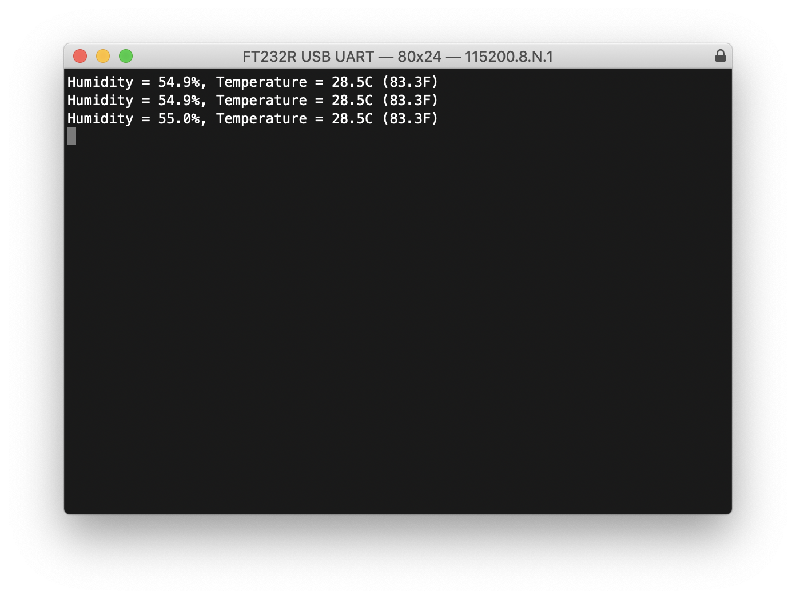

= DHT-11, DHT-22, and AM2302 Sensors
:xrefstyle: short

The DHT sensors are fairly well known hobbyist sensors for measuring relative humidity and temperature using a capacitive humidity sensor, and a thermistor. While they are slow, one reading every ~2 seconds, they are reliable and good for basic data logging. Communication is based on a custom protocol which uses a single wire for data. 

[NOTE]
======
The DHT-11 and DHT-22 sensors are the most common. They use the same protocol but have different characteristics, the DHT-22 has better accuracy, and has a larger sensor range than the DHT-11. The sensor is available from a number of retailers.
======

== Wiring information

See <<dht-wiring-diagram>> for wiring instructions.

[[dht-wiring-diagram]]
[pdfwidth=75%]
.Wiring the DHT-22 temperature sensor to Raspberry Pi Pico, and connecting Pico's UART0 to the Raspberry Pi 4.
image::pi-and-pico-uart-and-dht-sensor.png[]

NOTE: One of the pins (pin 3) on the DHT sensor will not be connected, it is not used.

You will want to place a 10 kΩ resistor between VCC and the data pin, to act as a medium-strength pull up on the data line. 

Connecting UART0 of Pico to Raspberry Pi as in <<dht-wiring-diagram>> and you should see something similar to <<dht-serial-output-diagram>> in `minicom` when connected to `/dev/serial0` on the Raspberry Pi.

[[dht-serial-output-diagram]]
[pdfwidth=75%]
.Serial output over Pico's UART0 in a terminal window.

Connect to `/dev/serial0` by typing,

----
$ minicom -b 115200 -o -D /dev/serial0
----

at the command line.

== List of Files

A list of files with descriptions of their function;

CMakeLists.txt:: Make file to incorporate the example in to the examples build tree.
dht.c:: The example code.

== Bill of Materials

.A list of materials required for the example
[[dht-22-bom-table]]
[cols=3]
|===
| *Item* | *Quantity* | Details
| Breadboard | 1 | generic part
| Raspberry Pi Pico | 1 | https://www.raspberrypi.com/products/raspberry-pi-pico/
| 10 kΩ resistor | 1 | generic part
| M/M Jumper wires | 4 | generic part
| DHT-22 sensor | 1 | generic part
|===
