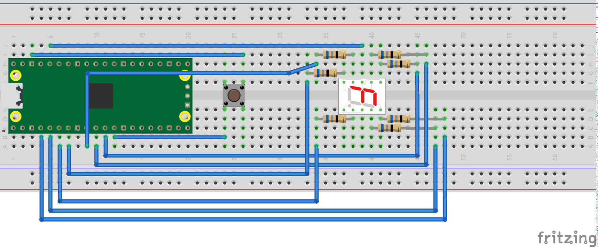

= Attaching a 7 segment LED via GPIO

This example code shows how to interface the Raspberry Pi Pico to a generic 7 segment LED device. It uses the LED to count from 0 to 9 and then repeat.  If the button is pressed, then the numbers will count down instead of up.

== Wiring information

Our 7 Segment display has pins as follows.

----
  --A--
  F   B
  --G--
  E   C
  --D--
----

By default we are allocating GPIO 2 to segment A, 3 to B etc.
So, connect GPIO 2 to pin A on the 7 segment LED display and so on. You will need the appropriate resistors (68 ohm should be fine) for each segment.
The LED device used here is common anode, so the anode pin is connected to the 3.3v supply, and the GPIOs need to pull low (to ground) to complete the circuit.
The pull direction of the GPIOs is specified in the code itself.

Connect the switch to connect on pressing. One side should be connected to ground, the other to GPIO 9.

[[hello_7segment_wiring]]
[pdfwidth=75%]
.Wiring Diagram for 7 segment LED.

== List of Files

CMakeLists.txt:: CMake file to incorporate the example in to the examples build tree.
hello_7segment.c:: The example code.

== Bill of Materials

.A list of materials required for the example
[[hello_7segment-bom-table]]
[cols=3]
|===
| *Item* | *Quantity* | Details
| Breadboard | 1 | generic part
| Raspberry Pi Pico | 1 | https://www.raspberrypi.com/products/raspberry-pi-pico/
| 7 segment LED module | 1 | generic part
| 68 ohm resistor | 7 | generic part
| DIL push to make switch | 1 | generic switch
| M/M Jumper wires | 10 | generic part
|===
