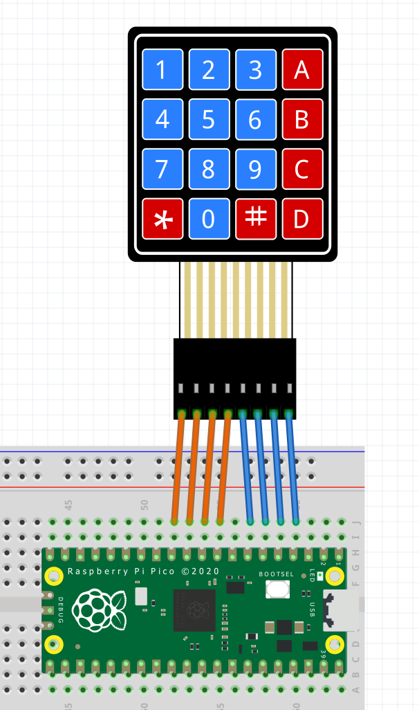

= Keypad Example for Raspberry Pi Pico

This document provides details about the 4x4 keypad example included in the larger repository of examples for Raspberry Pi Pico. This example demonstrates how to interface a 4x4 matrix keypad with the Pico and includes both simple and enhanced key detection modes.

== Introduction

This example shows how to use a 4x4 matrix keypad with the Raspberry Pi Pico. It has been enhanced to support detecting multiple key presses simultaneously, alongside the original single key press functionality.

== Features

* Simple key detection (one key press at a time)
* Enhanced key detection (multiple keys pressed simultaneously)
* Configurable maximum number of simultaneous key presses
* Mode switching via macro definition

== Hardware Requirements

* Raspberry Pi Pico
* 4x4 matrix keypad
* Connecting wires

== Wiring Instructions

Follow these wiring instructions to connect the 4x4 matrix keypad to the Raspberry Pi Pico:

[image2]

=== Wiring Table

The following table shows the GPIO pins used for the rows and columns of the keypad:

[width="50%",cols="1,1,1",options="header"]
|===
| Keypad Row/Column | GPIO Pin | Pin Number

| Row 0 | GP9  | 9
| Row 1 | GP8  | 8
| Row 2 | GP7  | 7
| Row 3 | GP6  | 6

| Column 0 | GP5  | 5
| Column 1 | GP4  | 4
| Column 2 | GP2  | 2
| Column 3 | GP1  | 1
|===

Ensure that the keypad rows and columns are connected to the GPIO pins on the Pico as indicated in the table.

== Usage

This example can be compiled and run to interact with the keypad. 

=== Simple Mode

In simple mode, the `get_keypad_value` function returns a single character corresponding to the pressed key. If no key is pressed, it returns a constant value indicating no key press.

[source,c]
----
char get_keypad_value();
----

=== Enhanced Mode

In enhanced mode, the `get_keypad_result` function returns a `KeypadResult` structure containing the count of pressed keys and a list of those keys.

[source,c]
----
KeypadResult get_keypad_result();
----

The `KeypadResult` structure is defined as follows:

[source,c]
----
typedef struct {
    int count;                   // Number of pressed keys
    char keys[MAX_MULTI_KEYS];   // Pressed keys
} KeypadResult;
----

== Example Output

=== Simple Mode

If a key is pressed, the output will be:

[source, plain]
----
Key 'A' pressed
----

If no key is pressed, the output will be:

[source, plain]
----
No key pressed
----

=== Enhanced Mode

If multiple keys are pressed, the output will be:

[source, plain]
----
Bang!!! '2' key(s) are pressed. Keys: A, B
----

If no keys are pressed, the output will be:

[source, plain]
----
No key pressed
----

== Additional Information

For contributing to the repository, refer to the link:../../CONTRIBUTING.md[CONTRIBUTING.md] file.

For licensing information, see the link:../../LICENSE.TXT[LICENSE.TXT] file.
