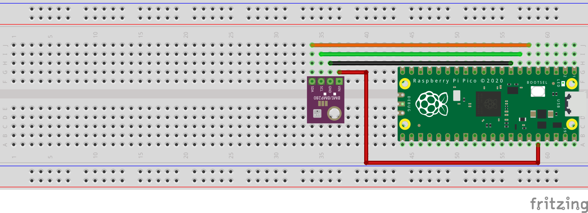

= Attaching a BMP280 temp/pressure sensor via I2C

This example code shows how to interface the Raspberry Pi Pico with the popular BMP280 temperature and air pressure sensor manufactured by Bosch. A similar variant, the BME280, exists that can also measure humidity. There is another example that uses the BME280 device but talks to it via SPI as opposed to I2C.

The code reads data from the sensor's registers every 500 milliseconds and prints it via the onboard UART. This example operates the BMP280 in _normal_ mode, meaning that the device continuously cycles between a measurement period and a standby period at a regular interval we can set. This has the advantage that subsequent reads do not require configuration register writes and is the recommended mode of operation to filter out short-term disturbances.

[TIP]
======
The BMP280 is highly configurable with 3 modes of operation, various oversampling levels, and 5 filter settings. Find the datasheet online (https://www.bosch-sensortec.com/media/boschsensortec/downloads/datasheets/bst-bmp280-ds001.pdf) to explore all of its capabilities beyond the simple example given here.
======

== Wiring information

Wiring up the device requires 4 jumpers, to connect VCC (3.3v), GND, SDA and SCL. The example here uses the default I2C port 0, which is assigned to GPIO 4 (SDA) and 5 (SCL) in software. Power is supplied from the 3.3V pin from the Pico.

WARNING: The BMP280 has a maximum supply voltage rating of 3.6V. Most breakout boards have voltage regulators that will allow a range of input voltages of 2-6V, but make sure to check beforehand.

[[bmp280_i2c_wiring]]
[pdfwidth=75%]
.Wiring Diagram for BMP280 sensor via I2C.

== List of Files

CMakeLists.txt:: CMake file to incorporate the example into the examples build tree.
bmp280_i2c.c:: The example code.

== Bill of Materials

.A list of materials required for the example
[[bmp280_i2c-bom-table]]
[cols=3]
|===
| *Item* | *Quantity* | Details
| Breadboard | 1 | generic part
| Raspberry Pi Pico | 1 | https://www.raspberrypi.com/products/raspberry-pi-pico/
| BMP280-based breakout board | 1 | https://shop.pimoroni.com/products/bmp280-breakout-temperature-pressure-altitude-sensor[from Pimoroni]
| M/M Jumper wires | 4 | generic part
|===

