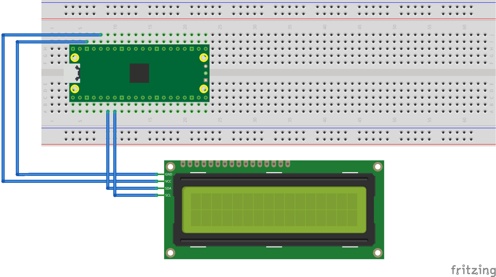

= Attaching a 16x2 LCD via I2C

This example code shows how to interface the Raspberry Pi Pico to one of the very common 16x2 LCD character displays. The display will need a 3.3V I2C adapter board as this example uses I2C for communications.

[NOTE]
======
These LCD displays can also be driven directly using GPIO without the use of an adapter board. That is beyond the scope of this example.
======

== Wiring information

Wiring up the device requires 4 jumpers, to connect VCC (3.3v), GND, SDA and SCL. The example here uses I2C port 0, which is assigned to GPIO 4 (SDA) and 5 (SCL) in software. Power is supplied from the 3.3V pin.

WARNING: Many displays of this type are 5v. If you wish to use a 5v display you will need to use level shifters on the SDA and SCL lines to convert from the 3.3V used by the RP2040. Whilst a 5v display will just about work at 3.3v, the display will be dim.

[[lcd_1602_i2c_wiring]]
[pdfwidth=75%]
.Wiring Diagram for LCD1602A LCD with I2C bridge.

== List of Files

CMakeLists.txt:: CMake file to incorporate the example in to the examples build tree.
lcd_1602_i2c.c:: The example code.

== Bill of Materials

.A list of materials required for the example
[[lcd_1602_i2c-bom-table]]
[cols=3]
|===
| *Item* | *Quantity* | Details
| Breadboard | 1 | generic part
| Raspberry Pi Pico | 1 | https://www.raspberrypi.com/products/raspberry-pi-pico/
| 1602A based LCD panel 3.3v | 1 | generic part
| 1602A to I2C bridge device 3.3v | 1 | generic part
| M/M Jumper wires | 4 | generic part
|===
