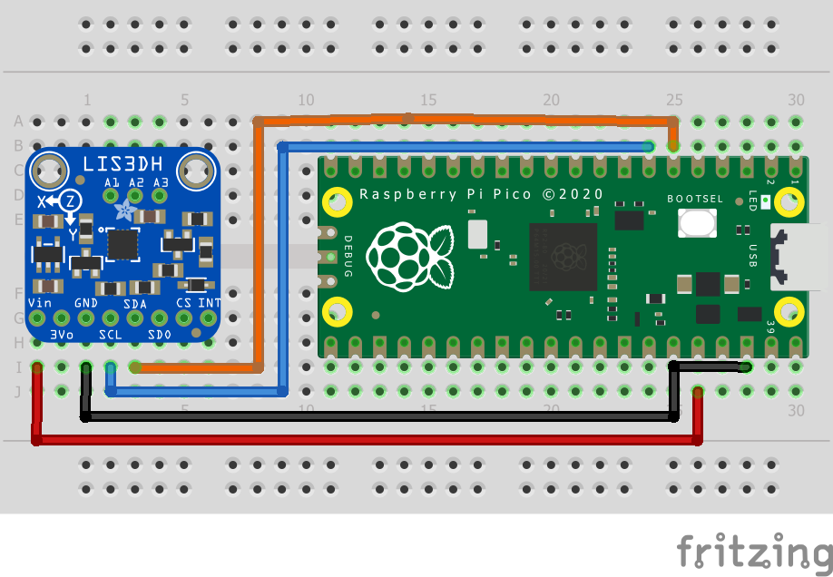

= Attaching a LIS3DH Nano Accelerometer via i2c.

This example shows you how to interface the Raspberry Pi Pico to the LIS3DH accelerometer and temperature sensor.

The code reads and displays the acceleration values of the board in the 3 axes and the ambient temperature value. The datasheet for the sensor can be found at https://www.st.com/resource/en/datasheet/cd00274221.pdf. The device is being operated on 'normal mode' and at a frequency of 1.344 kHz (this can be changed by editing the ODR bits of CTRL_REG4). The range of the data is controlled by the FS bit in CTRL_REG4 and is equal to ±2g in this example. The sensitivity depends on the operating mode and data range; exact values can be found on page 10 of the datasheet. In this case, the sensitivity value is 4mg (where g is the value of gravitational acceleration on the surface of Earth). In order to use the auxiliary ADC to read temperature, the we must set the BDU bit to 1 in CTRL_REG4 and the ADC_EN bit to 1 in TEMP_CFG_REG. Temperature is communicated through ADC 3. 

[NOTE]
=====
The sensor doesn't have features to eliminate offsets in the data and these will need to be taken into account in the code. 
=====

== Wiring information

Wiring up the device requires 4 jumpers, to connect VIN, GND, SDA and SCL. The example here uses I2C port 0, which is assigned to GPIO 4 (SDA) and 5 (SCL) in software. Power is supplied from the 3V pin.

[[lis3dh_i2c_wiring]]
[pdfwidth=75%]
.Wiring Diagram for LIS3DH.

== List of Files

CMakeLists.txt:: CMake file to incorporate the example in to the examples build tree.
lis3dh_i2c.c:: The example code.

== Bill of Materials

.A list of materials required for the example
[[lis3dh-bom-table]]
[cols=3]
|===
| *Item* | *Quantity* | Details
| Breadboard | 1 | generic part
| Raspberry Pi Pico | 1 | https://www.raspberrypi.com/products/raspberry-pi-pico/
| LIS3DH board| 1 | https://www.adafruit.com/product/2809
| M/M Jumper wires | 4 | generic part
|===
