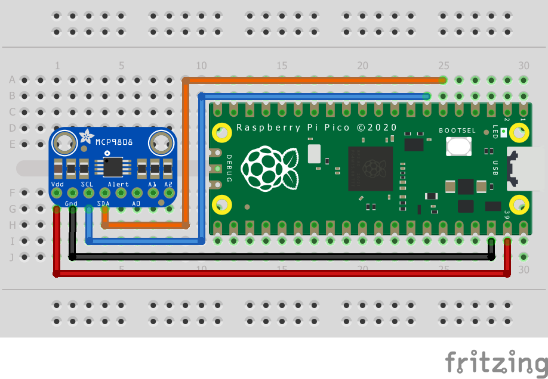

= Attaching a MCP9808 digital temperature sensor via I2C

This example code shows how to interface the Raspberry Pi Pico to the MCP9808 digital temperature sensor board. 

This example reads the ambient temperature value each second from the sensor and sets upper, lower and critical limits for the temperature and checks if alerts need to be raised. The CONFIG register can also be used to check for an alert if the critical temperature is surpassed.

== Wiring information

Wiring up the device requires 4 jumpers, to connect VDD, GND, SDA and SCL. The example here uses I2C port 0, which is assigned to GPIO 4 (SDA) and 5 (SCL) in software. Power is supplied from the VSYS pin.

[[mcp9808_i2c_wiring]]
[pdfwidth=75%]
.Wiring Diagram for MCP9808.

== List of Files

CMakeLists.txt:: CMake file to incorporate the example in to the examples build tree.
mcp9808_i2c.c:: The example code.

== Bill of Materials

.A list of materials required for the example
[[mcp9808-bom-table]]
[cols=3]
|===
| *Item* | *Quantity* | Details
| Breadboard | 1 | generic part
| Raspberry Pi Pico | 1 | https://www.raspberrypi.com/products/raspberry-pi-pico/
| MCP9808 board| 1 | https://www.adafruit.com/product/1782
| M/M Jumper wires | 4 | generic part
|===

