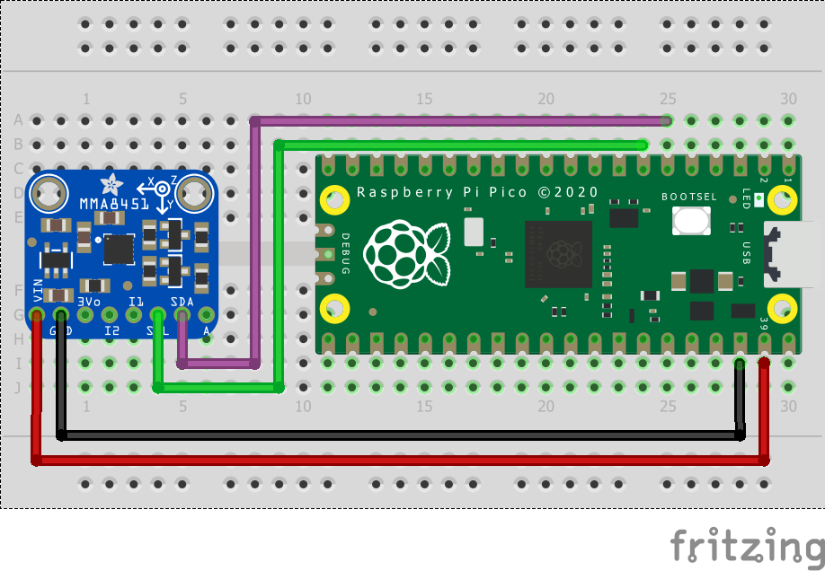

= Attaching a MMA8451 3-axis digital accelerometer via I2C

This example code shows how to interface the Raspberry Pi Pico to the MMA8451 digital accelerometer sensor board. 

This example reads and displays the acceleration values of the board in the 3 axis. It also allows the user to set the trade-off between the range and precision based on the values they require. Values often have an offset which can be accounted for by writing to the offset correction registers. The datasheet for the sensor can be found at https://cdn-shop.adafruit.com/datasheets/MMA8451Q-1.pdf for additional information.

== Wiring information

Wiring up the device requires 4 jumpers, to connect VIN, GND, SDA and SCL. The example here uses I2C port 0, which is assigned to GPIO 4 (SDA) and 5 (SCL) in software. Power is supplied from the VSYS pin.

[[mma8451_i2c_wiring]]
[pdfwidth=75%]
.Wiring Diagram for MMA8451.

== List of Files

CMakeLists.txt:: CMake file to incorporate the example in to the examples build tree.
mma8451_i2c.c:: The example code.

== Bill of Materials

.A list of materials required for the example
[[mma8451-bom-table]]
[cols=3]
|===
| *Item* | *Quantity* | Details
| Breadboard | 1 | generic part
| Raspberry Pi Pico | 1 | https://www.raspberrypi.com/products/raspberry-pi-pico/
| MMA8451 board| 1 | https://www.adafruit.com/product/2019
| M/M Jumper wires | 4 | generic part
|===

