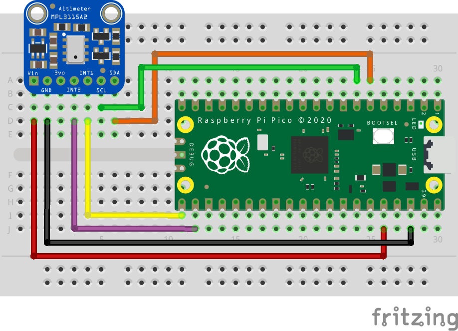

= Attaching an MPL3115A2 altimeter via I2C

This example code shows how to interface the Raspberry Pi Pico to an MPL3115A2 altimeter via I2C. The MPL3115A2 has onboard pressure and temperature sensors which are used to estimate the altitude. In comparison to the BMP- family of pressure and temperature sensors, the MPL3115A2 has two interrupt pins for ultra low power operation and takes care of the sensor reading compensation on the board! It also has multiple modes of operation and impressive operating conditions.

The board used in this example https://www.adafruit.com/product/1893[comes from Adafruit], but any MPL3115A2 breakouts should work similarly.

The MPL3115A2 makes available two ways of reading its temperature and pressure data. The first is known as polling, where the Pico will continuously read data out of a set of auto-incrementing registers which are refreshed with new data every so often. The second, which this example will demonstrate, uses a 160-byte first-in-first-out (FIFO) queue and configurable interrupts to tell the Pico when to read data. More information regarding when the interrupts can be triggered available https://www.nxp.com/docs/en/data-sheet/MPL3115A2.pdf[in the datasheet].

TIP: Choosing the right sensor for your project among so many choices can be hard! There are multiple factors you may have to consider in addition to any constraints imposed on you. Cost, operating temperature, sensor resolution, power consumption, ease of use, communication protocols and supply voltage are all but a few factors that can play a role in sensor choice. For most hobbyist purposes though, the majority of sensors out there will do just fine! 

== Wiring information

Wiring up the device requires 6 jumpers, to connect VCC (3.3v), GND, INT1, INT2, SDA and SCL. The example here uses I2C port 0, which is assigned to GPIO 4 (SDA) and GPIO 5 (SCL) by default. Power is supplied from the 3.3V pin.

NOTE: The MPL3115A2 has a 1.6-3.6V voltage supply range. This means it can work with the Pico's 3.3v pins out of the box but our Adafruit breakout has an onboard voltage regulator for good measure. This may not always be true of other sensors, though.

[[mpl3115a2_i2c_wiring]]
[pdfwidth=75%]
.Wiring Diagram for MPL3115A2 altimeter.

== List of Files

CMakeLists.txt:: CMake file to incorporate the example in to the examples build tree.
mpl3115a2_i2c.c:: The example code.

== Bill of Materials

.A list of materials required for the example
[[mpl3115a2-i2c-bom-table]]
[cols=3]
|===
| *Item* | *Quantity* | Details
| Breadboard | 1 | generic part
| Raspberry Pi Pico | 1 | http://raspberrypi.org/
| MPL3115A2 altimeter | 1 | https://www.adafruit.com/product/1893[Adafruit]
| M/M Jumper wires | 5 | generic part
|===
