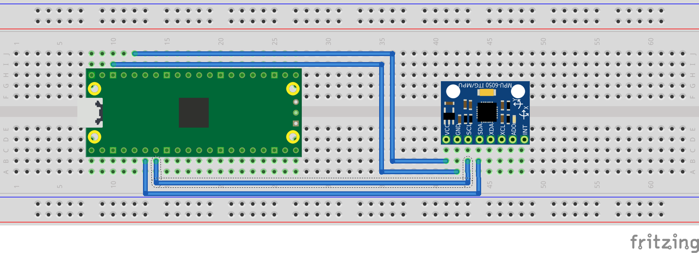

= Attaching a MPU6050 accelerometer/gyroscope via I2C

This example code shows how to interface the Raspberry Pi Pico to the MPU6050 accelerometer/gyroscope board. This device uses I2C for communications, and most MPU6050 parts are happy running at either 3.3 or 5v. The Raspberry Pi RP2040 GPIO's work at 3.3v so that is what the example uses.

[NOTE]
======
This is a very basic example, and only recovers raw data from the sensor. There are various calibration options available that should be used to ensure that the final results are accurate. It is also possible to wire up the interrupt pin to a GPIO and read data only when it is ready, rather than using the polling approach in the example.
======

== Wiring information

Wiring up the device requires 4 jumpers, to connect VCC (3.3v), GND, SDA and SCL. The example here uses I2C port 0, which is assigned to GPIO 4 (SDA) and 5 (SCL) in software. Power is supplied from the 3.3V pin.

[NOTE]
======
There are many different manufacturers who sell boards with the MPU6050. Whilst they all appear slightly different, they all have, at least, the same 4 pins required to power and communicate. When wiring up a board that is different to the one in the diagram, ensure you connect up as described in the previous paragraph.
======

[[mpu6050_i2c_wiring]]
[pdfwidth=75%]
.Wiring Diagram for MPU6050.

== List of Files

CMakeLists.txt:: CMake file to incorporate the example in to the examples build tree.
mpu6050_i2c.c:: The example code.

== Bill of Materials

.A list of materials required for the example
[[mpu6050-bom-table]]
[cols=3]
|===
| *Item* | *Quantity* | Details
| Breadboard | 1 | generic part
| Raspberry Pi Pico | 1 | https://www.raspberrypi.com/products/raspberry-pi-pico/
| MPU6050 board| 1 | generic part
| M/M Jumper wires | 4 | generic part
|===
