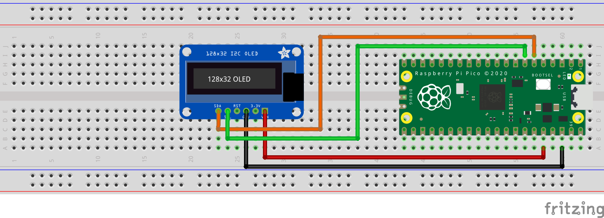

= Attaching an OLED display via I2C

This example code shows how to interface the Raspberry Pi Pico with an 128x32 OLED display board based on the SSD1306 display driver, datasheet https://cdn-shop.adafruit.com/datasheets/SSD1306.pdf[here].

The code displays a series of tiny raspberries that scroll horizontally, in the process showing you how to initialize the display, write to the entire display, write to only a portion of the display, and configure scrolling.

The SSD1306 is operated via a list of versatile commands (see datasheet) that allows the user to access all the capabilities of the driver. After sending a slave address, the data that follows can be either a command, flags to follow up a command or data to be written directly into the display's RAM. A control byte is required for each write after the slave address so that the driver knows what type of data is being sent.

This display is 32 pixels high by 128 pixels wide. These 32 vertical pixels are partitioned into 4 pages, each 8 pixels in height. In RAM, this looks roughly like:

[NOTE]
======
The SSD1306 can drive displays that are up to 64 pixels high and 128 pixels wide.
======

----
           | COL0 | COL1 | COL2 | COL3 |  ...  | COL126 | COL127 |
    PAGE 0 |      |      |      |      |       |        |        |
    PAGE 1 |      |      |      |      |       |        |        |
    PAGE 2 |      |      |      |      |       |        |        |
    PAGE 3 |      |      |      |      |       |        |        |
    --------------------------------------------------------------
----

Within each page, we have:

----
          | COL0 | COL1 | COL2 | COL3 |  ...  | COL126 | COL127 |
    COM 0 |      |      |      |      |       |        |        |   
    COM 1 |      |      |      |      |       |        |        |   
       :  |      |      |      |      |       |        |        |  
    COM 7 |      |      |      |      |       |        |        |
    -------------------------------------------------------------
----

[NOTE]
======
There is a difference between columns in RAM and the actual segment pads that connect the driver to the display. The RAM addresses COL0 - COL127 are mapped to these segment pins SEG0 - SEG127 by default. The distinction between these two is important as we can for example,  easily mirror contents of RAM without rewriting a buffer.
======

The driver has 3 modes of transferring the pixels in RAM to the display (provided that the driver is set to use its RAM content to drive the display, ie. command 0xA4 is sent). We choose horizontal addressing mode which, after setting the column address and page address registers to our desired start positions, will increment the column address register until the OLED display width is reached (127 in our case) after which the column address register will reset to its starting value and the page address is incremented. Once the page register reaches the end, it will wrap around as well. Effectively, this scans across the display from top to bottom, left to right in blocks that are 8 pixels high. When a byte is sent to be written into RAM, it sets all the rows for the current position of the column address register. So, if we send 10101010, and we are on PAGE 0 and COL1, COM0 is set to 1, COM1 is set to 0, COM2 is set to 1, and so on. Effectively, the byte is "transposed" to fill a single page's column. The datasheet has further information on this and the two other modes.

Horizontal addressing mode has the key advantage that we can keep one single 512 byte buffer (128 columns x 4 pages and each byte fills a page's rows) and write this in one go to the RAM (column address auto increments on writes as well as reads) instead of working with 2D matrices of pixels and adding more overhead. 

[NOTE]
======
* The SSD1306 is able to drive 128x64 displays but as our display is 128x32, only half of the COM (common) pins are connected to the display.
* The specific display model being used is UG-2832HSWEG02
======

== Wiring information

Wiring up the device requires 4 jumpers, to connect VCC (3.3v), GND, SDA and SCL and optionally a 5th jumper for the driver RESET pin. The example here uses the default I2C port 0, which is assigned to GPIO 4 (SDA) and 5 (SCL) in software. Power is supplied from the 3.3V pin from the Pico.

[[oled_i2c_wiring]]
[pdfwidth=75%]
.Wiring Diagram for oled display via I2C.

== List of Files

CMakeLists.txt:: CMake file to incorporate the example into the examples build tree.
oled_i2c.c:: The example code.

== Bill of Materials

.A list of materials required for the example
[[oled_i2c-bom-table]]
[cols=3]
|===
| *Item* | *Quantity* | Details
| Breadboard | 1 | generic part
| Raspberry Pi Pico | 1 | https://www.raspberrypi.com/products/raspberry-pi-pico/
| SSD1306-based OLED display | 1 | https://www.adafruit.com/product/4440[Adafruit part]
| M/M Jumper wires | 4 | generic part
|===
