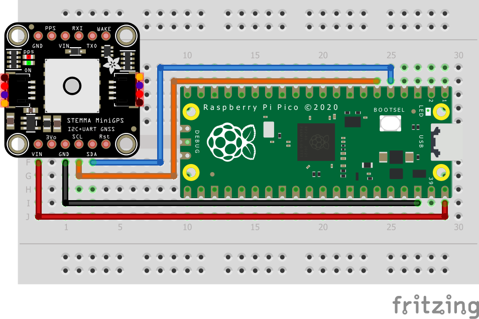

= Attaching a PA1010D Mini GPS module via I2C

This example code shows how to interface the Raspberry Pi Pico to the PA1010D Mini GPS module

This allows you to read basic location and time data from the Recommended Minimum Specific GNSS Sentence (GNRMC protocol) and displays it in a user-friendly format. The datasheet for the module can be found on https://cdn-learn.adafruit.com/assets/assets/000/084/295/original/CD_PA1010D_Datasheet_v.03.pdf?1573833002. The output sentence is read and parsed to split the data fields into a 2D character array, which are then individually printed out. The commands to use different protocols and change settings are found on https://www.sparkfun.com/datasheets/GPS/Modules/PMTK_Protocol.pdf. Additional protocols can be used by editing the `init_command` array. 

[NOTE]
======
Each command requires a checksum after the asterisk. The checksum can be calculated for your command using the following website: https://nmeachecksum.eqth.net/.

The GPS needs to be used outdoors in open skies and requires about 15 seconds to acquire a satellite signal in order to display valid data. When the signal is detected, the device will blink a green LED at 1 Hz.
======

== Wiring information

Wiring up the device requires 4 jumpers, to connect VDD, GND, SDA and SCL. The example here uses I2C port 0, which is assigned to GPIO 4 (SDA) and 5 (SCL) in software. Power is supplied from the 3V pin.

[[pa1010d_i2c_wiring]]
[pdfwidth=75%]
.Wiring Diagram for PA1010D.

== List of Files

CMakeLists.txt:: CMake file to incorporate the example in to the examples build tree.
pa1010d_i2c.c:: The example code.

== Bill of Materials

.A list of materials required for the example
[[pa1010d-bom-table]]
[cols=3]
|===
| *Item* | *Quantity* | Details
| Breadboard | 1 | generic part
| Raspberry Pi Pico | 1 | https://www.raspberrypi.com/products/raspberry-pi-pico/
| PA1010D board| 1 | https://shop.pimoroni.com/products/pa1010d-gps-breakout
| M/M Jumper wires | 4 | generic part
|===

