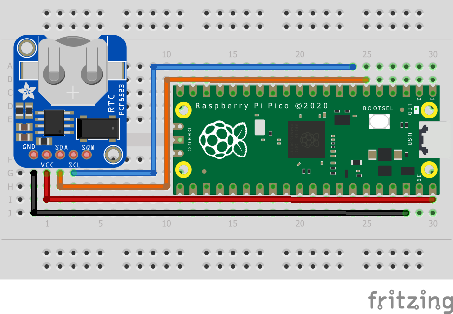

= Attaching a PCF8523 Real Time Clock via I2C

This example code shows how to interface the Raspberry Pi Pico to the PCF8523 Real Time Clock

This example allows you to initialise the current time and date and then displays it every half-second. Additionally it lets you set an alarm for a particular time and date and raises an alert accordingly. More information about the module is available at https://learn.adafruit.com/adafruit-pcf8523-real-time-clock. 

== Wiring information

Wiring up the device requires 4 jumpers, to connect VDD, GND, SDA and SCL. The example here uses I2C port 0, which is assigned to GPIO 4 (SDA) and 5 (SCL) in software. Power is supplied from the 5V pin.

[[pcf8523_i2c_wiring]]
[pdfwidth=75%]
.Wiring Diagram for PCF8523.

== List of Files

CMakeLists.txt:: CMake file to incorporate the example in to the examples build tree.
pcf8523_i2c.c:: The example code.

== Bill of Materials

.A list of materials required for the example
[[pcf8523-bom-table]]
[cols=3]
|===
| *Item* | *Quantity* | Details
| Breadboard | 1 | generic part
| Raspberry Pi Pico | 1 | https://www.raspberrypi.com/products/raspberry-pi-pico/
| PCF8523 board| 1 | https://www.adafruit.com/product/3295
| M/M Jumper wires | 4 | generic part
|===

