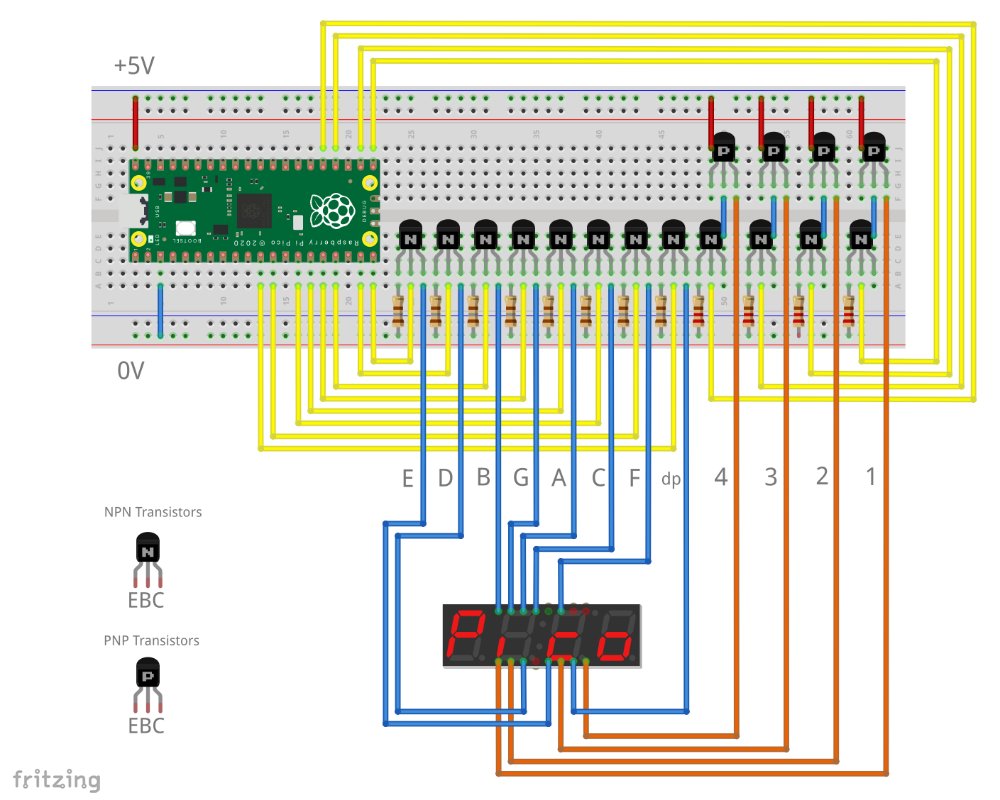
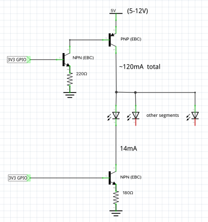

= Driving a 7 segment LED display with the PIO

This example demonstrates how the RP2040 PIO can be used to control a four digit multiplexed 7-segment display.

Multiplexed displays work by rapidly displaying each digit in turn. The PIO is a good way to relieve the CPU of this repetitive task.

The code uses four `side-set` pins to control the digit multiplex lines and displays the segment patterns received on the FIFO. A non-blocking PULL is used to keep showing the same segments until the CPU sends new data.

The provided example spells out the word **Pico**  then counts from 0 to 9999.

== Wiring information

Miniature _('bubble')_ displays can sometimes be driven directly from the GPIO pins but full sized ones usually need an external drive circuit like the example shown.

Connect the circuit to an external 5V supply or power it via USB (in which case you may prefer to take the  _+5V_ rail from _VBUS_).

TIP: make any changes required for your display and transistors: this is for a _common anode_ display that takes about 15mA per segment.

[[pio_7_segment_wiring]]
[pdfwidth=75%]
.Wiring diagram

[[pio_7_segment_schematic]]
[pdfwidth=50%]
.Schematic (common anode driver)

[[pio_7_segment_connections-table]]
.Connections table
[options="header,footer"]
|==================================================
|RP2040 |Pico pin   |Display driver
|GP8    |11 |segment dp
|GP9    |12 |segment F
|GP10   |14 |segment C
|GP11   |15 |segment A
|GP12   |16 |segment G
|GP13   |17 |segment B
|GP14   |19 |segment D
|GP15   |20 |segment E
|GP16   |21 |digit 1 (thousands)
|GP17   |22 |digit 2 (hundreds)
|GP18   |24 |digit 3 (tens)
|GP19   |25 |digit 4 (units)
|==================================================

== Bill of materials

.A list of materials for the example circuit
[[pio_onewire_bom-table]]
[cols=3]
|===
| *Item*  | *Quantity* | *Details*
| Breadboard | 1 | generic part
| Raspberry Pi Pico | 1 | https://www.raspberrypi.com/products/raspberry-pi-pico/
| 4 digit 7 segment display (common anode) | 1 | e.g. https://shop.pimoroni.com/products/4-digit-7-segment-display
| NPN bipolar transistor | 12 | e.g. https://thepihut.com/products/npn-bipolar-transistors-pn2222-10-pack (10-pack)
| PNP bipolar transistor | 4 | e.g. https://thepihut.com/products/bipolar-transistor-kit-5-x-pn2222-npn-and-5-x-pn2907-pnp (5-PNP + 5-NPN)
| 180 ohm resistor | 8 | generic part
| 220 ohm resistor | 4 | generic part
| M/M jumper wire | 22 | generic part
| M/F jumper wire | 12 | generic part
|===