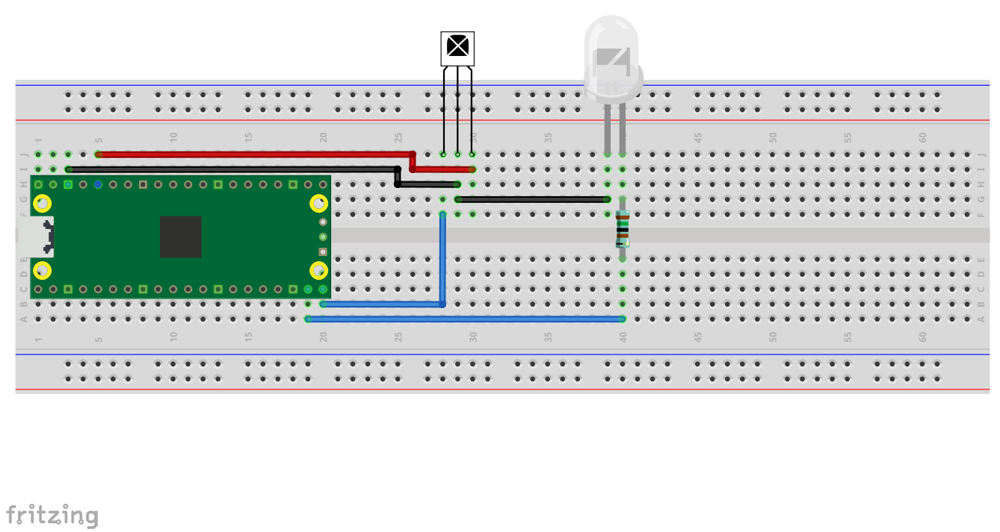

= Sending and receiving IR (infra-red) codes using the PIO

This example shows how to use the Raspberry Pi Pico (RP2040) to send and receive infra-red frames in the 'NEC' format that is used by many consumer remote control applications.

It performs a loopback test by transmitting IR codes via an IR LED and receiving them on an IR detector. The results are sent to the default serial terminal connnected via UART or USB as configured in the SDK.

The tasks of encoding and decoding the data are offloaded to the RP2040 PIO state machines. This releases the main processor cores to concentrate on other tasks.

== Wiring information

Connect GPIO 14 to the positive side ('anode') of an IR LED via a suitable series resistor e.g. 1.5k Ohms, and the negative side ('cathode') to ground. The wavelength of the LED is unlikely to be critical so long as it is compatible with your detector.

Connect GPIO 15 to the output of a 3.3v IR detector such as the VS1838b, and wire the power connections of the detector to 3v3 and ground. The program expects the decoder output to be low (logic '0') when a carrier is detected.

[[pio_ir_loopback_wiring]]
[pdfwidth=75%]
.Wiring Diagram for IR loopback.

== Build information

The code is organised into three sub-directories. These contain the loopback example and two libraries for the IR transmit and receive functions.

After a successful build the executable program can be found in the **build/ir_loopback** directory.

== List of Files

CMakeLists.txt:: CMake file to incorporate the example in to the examples build tree.
ir_loopback/CMakeLists.txt:: CMake file to incorporate the loopback example in to the examples build tree.
ir_loopback/ir_loopback.c:: The code for the loopback example.
nec_receive_library/CMakeLists.txt:: CMake file to incorporate the IR receive library in to the examples build tree.
nec_receive_library/nec_receive.c:: The source code for the IR receive functions.
nec_receive_library/nec_receive.h:: The headers for the IR receive functions.
nec_receive_library/nec_receive.pio:: The PIO assembler code to receive a frame.
nec_transmit_library/CMakeLists.txt:: CMake file to incorporate the IR transmit library in to the examples build tree.
nec_transmit_library/nec_transmit.c:: The source code for the IR transmit functions.
nec_transmit_library/nec_transmit.h:: The headers for the IR transmit functions.
nec_transmit_library/nec_carrier_burst.pio:: The PIO assembler code to generate a carrier burst.
nec_transmit_library/nec_carrier_control.pio:: The PIO assembler code to transmit a complete frame.

== Bill of Materials

.A list of materials required for the example
[[pio_ir_loopback-bom-table]]
[cols=3]
|===
| *Item* | *Quantity* | Details
| Breadboard | 1 | generic part
| Raspberry Pi Pico | 1 | https://www.raspberrypi.com/products/raspberry-pi-pico/
| Infra-Red LED | 1 | generic part
| 1500 ohm resistor | 1 | generic part
| Infra-Red Detector | 1 | generic part e.g. VS1838b
| M/M Jumper wires | 5 | generic part
|===
