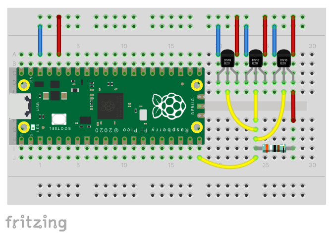

= Interfacing 1-Wire devices to the Pico

This example demonstrates how to use link:https://www.analog.com/en/technical-articles/guide-to-1wire-communication.html[1-Wire] devices with the Raspberry Pi Pico (RP2040).
1-Wire is an interface that enables a master to control several slave devices over a simple shared serial bus.

The example provides a 1-Wire library that is used to take readings from a set of connected link:https://www.analog.com/media/en/technical-documentation/data-sheets/ds18b20.pdf[DS18B20] 1-Wire temperature sensors. The results are sent to the default serial terminal connected via USB or UART as configured in the SDK.

The library uses a driver based on the RP2040 PIO state machine to generate accurate bus timings and control the 1-Wire bus via a GPIO pin.

_1-Wire(R) is a registered trademark of Maxim Integrated Products, Inc._

== Wiring information

Connect one or more DS18B20 sensors to the Pico as shown in the diagram and table below.

Connect GPIO 15 to 3V3(OUT) with a pull-up resistor of about 4k ohms.

[[pio_onewire_wiring-diagram]]
[pdfwidth=75%]
.Wiring diagram

[[pio_onewire_connections-table]]
.Connections table
[options="header,footer"]
|==================================================
|Pico    |pin         |DS18B20    |pin / sensor wire
|GND     |38 or equivalent   |GND        |1 / Black
|GPIO 15 |20          |DQ         |2 / Yellow
|3V3(OUT)|36          |VDD        |3 / Red
|==================================================

== Bill of materials

.A list of materials for the example circuit
[[pio_onewire_bom-table]]
[cols=3]
|===
| *Item*  | *Quantity* | *Details*
| Breadboard | 1 | generic part
| Raspberry Pi Pico | 1 | https://www.raspberrypi.com/products/raspberry-pi-pico/
| DS18B20 | 3 | chip or wired sensor
| 3900 ohm resistor | 1 | generic part
| M/M jumper wire | 13 | generic part
|===

== List of files
[[pio_onewire_file-list]]
CMakeLists.txt:: CMake file to incorporate the example in the build tree.
onewire.c:: Source code for the example program.
ow_rom.h:: Header file with generic ROM command codes for 1-Wire devices. 
ds18b20.h:: Header file with function command codes for the DS18B20 device.
onewire_library/:: Subdirectory containing the 1-Wire library and driver.
onewire_library/CMakeLists.txt:: CMake file to build the 1-Wire library and driver.
onewire_library/onewire_library.c:: Source code for the 1-Wire user functions.
onewire_library/onewire_library.h:: Header file for the 1-Wire user functions and types.
onewire_library/onewire_library.pio:: PIO assembly code for the 1-Wire driver.
