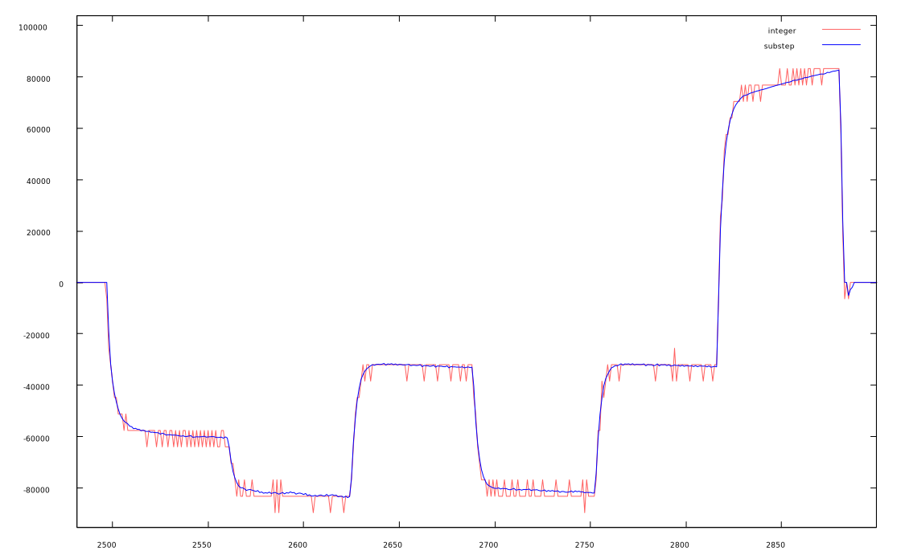
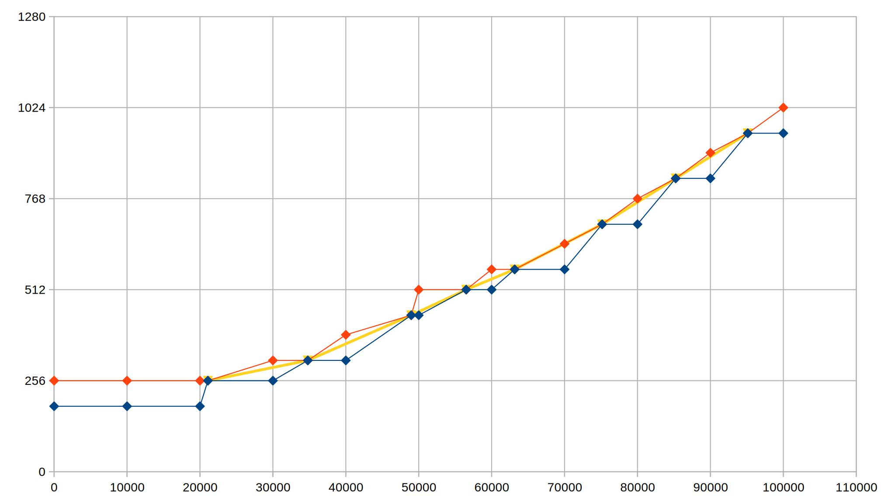

# Sub-Step Quadrature Encoder

## The problem

Hardware peripherals to read quadrature encoders (and the quadrature encoder example) count steps by looking at the sequence of phase states read from a quadrature encoder.

To estimate the encoder speed, the user can check how many steps were counted over a period of time. For instance, if the count was 120 at the beginning and was 134 10ms later, we can estimate that the speed is 14 steps in 10ms or 1400 steps per second.

This works relatively well for high counts, but at low speeds (or high sample rates), the quantization effect of looking at integer counts can introduce a high level of quantization noise in the speed measurement.

A different approach that would work better at low speeds, would be to measure the time it takes to advance one step and use its inverse to compute the speed. For instance, if one step takes 540us, then the speed is 1/0.000540 = ~1852 steps per second.

Unfortunately, as speed increases the resolution of this method decreases rapidly. At 100.000 steps per second, a step takes 10us. Measuring 9, 10 or 11 us per step will give speeds of 111k, 100k or 90k steps per second, respectively. 

Moreover, especially in low cost encoders, the phases are not all the same size which introduces another source of measurement noise if not compensated properly. 

## The Solution

The "sub-step" quadrature encoder code solves this problem by using an hybrid approach: the PIO code keeps track of the integer step count, but also how long ago was the last transition and the direction of that transition. The high level code can then use that information to compute a speed estimate that doesn't suffer from the integer quantization problem of just counting steps and can support high step rates as well.

The high level code also takes into account and compensates the phase size differences of the encoder.

The chart below shows the speed estimate using just integer step counts in red and the sub-step speed estimate in blue for an encoder connected to a DC motor doing some voltage step changes.

Note that unlike what we would get by doing a low-pass filter on the integer count signal, the sub-step version has no delay and does not limit the frequency response of the encoder.

## Usage

Because we need to keep some state information to compute a speed estimate from the previous transitions, the code requires a `substep_state_t` structure per encoder.

There are only 2 functions the user code needs to use:
- `substep_init_state`: initialize the PIO code and state structure
- `substep_update`: read the PIO and update the `speed` and `position` fields of the `substep_state_t` structure. The position is given in sub-steps and the speed is given in sub-steps per second

Note that since the PIO code uses 32 instructions and must be loaded at offset 0, the PIO used by this code can not be used for other purposes but can handle up to 4 encoders (one per state machine).

## Phase calibration

To increase the precision of the speed estimate, the user can run a calibration function to measure the relative sizes of the phases of the encoder. The sub-step code will then use this information to compensate the phase size differences while computing speed estimates. This is not strictly necessary, but if not done, the code will assume equal size phases, which will introduce noise, especially at low speeds.

Note that for an encoder to have perfectly balanced 90 degree phases, each individual phase would require a perfect 50% duty cycle and the phases would need to be exactly 90 degrees apart. That is rarely the case in low cost encoders.

To calibrate phase sizes (optional, but highly recommended), there are two more functions:

  - `substep_set_calibration_data`: set the relative phase positions. This function should always be called at program start, after calling `substep_init_state`
  - `substep_calibrate_phases`: this function should be used offline, on a test program, to get the phase sizes of an encoder. After getting the sizes, these can be passed as constants to `substep_set_calibration_data` without having to run this function again. To measure the phase sizes, make the encoder rotate forward (increasing step order) and call this function to measure the relative sizes of the encoder phases. It outputs the parameters that should be passed to `substep_set_calibration_data` to compensate for phase sizes. Ideally, the encoder should be rotating at a constant speed of around 2.000 steps per second, but any value from 200 sps to 20.000 sps without any abrupt changes in speed, should work as well

If you are curious about how unbalanced your encoder is, the calibration code for a perfect encoder should output `substep_set_calibration_data(&state, 64, 128, 192);`, i.e., each phase should be exactly 64 sub-steps in size

## Sub-step vs simple quadrature encoder code

Compared with the simple step counting version, this version has the advantage that it uses the information from the transition times to extract a much better speed and position estimate.

The disadvantages are a larger PIO program (32 instead of 24 instructions) and a bit more CPU time used when computing the speed estimate (just once per sample).

Like the simple version, it doesn't use CPU time while counting steps and it's only the update function that uses CPU time. Note that this function is called at the control frequency of your system, say 100Hz, and so the CPU time used is independent of the step rate of the encoder. To use as little CPU as possible, this function only uses integer arithmetic.

Note: the `substep_state_t` structure has a `raw_step` field that contains the same step count that would have been returned by the simple quadrature encoder code. This can be useful if, for instance, we have a project with a couple of DC motors with encoders (that would benefit from using the sub-step version), but also a rotary encoder for the user interface (for which we only need integer steps). 

## Implementation details

The chart below illustrates how the sub-step works. The horizontal scale is time in micro-seconds, the vertical step is in sub-steps. 4 hardware steps (one cycle) are always 256 sub-steps. To simplify, lets assume the phases are balanced and each step takes exactly 64 sub-steps.

The red line is the upper bound of the encoder position, whereas the blue line is the lower bound. The yellow line is the speed estimate.

At the start, the encoder is stopped at hardware step 3, so the sub-step estimate is between 192 and 256.

At 30ms, we read the data from the PIO and there was a transition at ~21ms and the current integer step is 4. At the time of the transition the lower and upper bounds for the position touch, because we know exactly where the encoder is in that instant.

At this point we don't know much about the speed. The sub-step position of the encoder could have been close to 256 (close to the upper bound) and it could still be there now (close to the lower bound).

At 40ms, we read the PIO again. The encoder as made another step so we know the sub-step position is between 320 and 384. We also know there was a transition at ~34ms, so we can compute a speed estimate as the encoder did 64 sub-steps in 34 - 21 = 13ms (note: the actual code uses micro-seconds).

At 50ms, the encoder actually did 2 steps, the sub-step position is now between 448 and 512 and the last transition was at ~49ms. Note that there were two transitions in this period, but we only get the latest transition from the PIO code. This still allows us to compute a new speed estimate, as we made 128 sub-steps in 49 - 34 = 15 ms.

On top of using actual transitions to compute the speed, the current step position is also used to give a upper and lower bound on the speed so that the code can react faster to large variations in speed.

To compensate for unbalanced phase sizes, the sub-step position assigned to each hardware step transition is not a multiple of 64 but instead depends on the phase size calibration. The lower bound of phase 0 is always a multiple of 256, though.

