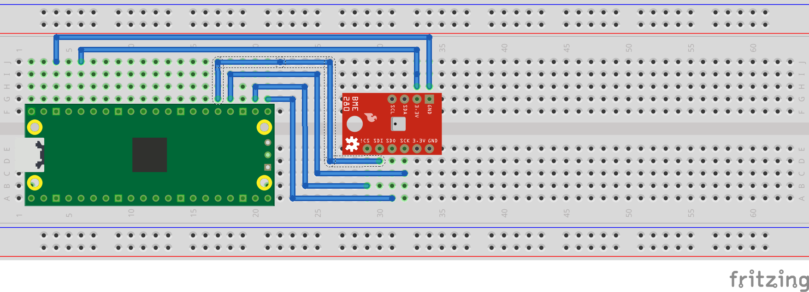

= Attaching a BME280 temperature/humidity/pressure sensor via SPI

This example code shows how to interface the Raspberry Pi Pico to a BME280 temperature/humidity/pressure. The particular device used can be interfaced via I2C or SPI, we are using SPI, and interfacing at 3.3v.

This examples reads the data from the sensor, and runs it through the appropriate compensation routines (see the chip datasheet for details https://www.bosch-sensortec.com/media/boschsensortec/downloads/datasheets/bst-bme280-ds002.pdf). At startup the compensation parameters required by the compensation routines are read from the chip.
)

== Wiring information

Wiring up the device requires 6 jumpers as follows:

   * GPIO 16 (pin 21) MISO/spi0_rx-> SDO/SDO on bme280 board
   * GPIO 17 (pin 22) Chip select -> CSB/!CS on bme280 board
   * GPIO 18 (pin 24) SCK/spi0_sclk -> SCL/SCK on bme280 board
   * GPIO 19 (pin 25) MOSI/spi0_tx -> SDA/SDI on bme280 board
   * 3.3v (pin 3;6) -> VCC on bme280 board
   * GND (pin 38)  -> GND on bme280 board

The example here uses SPI port 0. Power is supplied from the 3.3V pin.

[NOTE]
======
There are many different manufacturers who sell boards with the BME280. Whilst they all appear slightly different, they all have, at least, the same 6 pins required to power and communicate. When wiring up a board that is different to the one in the diagram, ensure you connect up as described in the previous paragraph.
======

[[BME280_spi_wiring]]
[pdfwidth=75%]
.Wiring Diagram for bme280.

== List of Files

CMakeLists.txt:: CMake file to incorporate the example in to the examples build tree.
bme280_spi.c:: The example code.

== Bill of Materials

.A list of materials required for the example
[[BME280-bom-table]]
[cols=3]
|===
| *Item* | *Quantity* | Details
| Breadboard | 1 | generic part
| Raspberry Pi Pico | 1 | https://www.raspberrypi.com/products/raspberry-pi-pico/
| BME280 board| 1 | generic part
| M/M Jumper wires | 6 | generic part
|===
