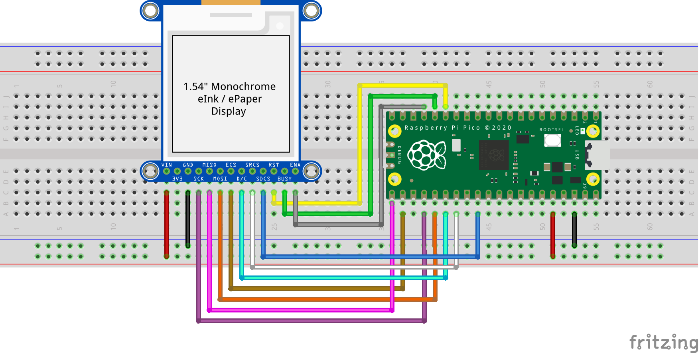

= Attaching a monochrome e-ink display via SPI

This example code shows how to interface the Raspberry Pi Pico to a SSD1618-based monochrome e-ink display.

TODO..

== Wiring information

Wiring up the device requires 12 jumpers as follows:

   * GPIO 11 (pin 15) -> RST on display
   * GPIO 12 (pin 16) -> BUSY on display
   * GPIO 13 (pin 17) -> ENA on display
   * GPIO 16 (pin 21) MISO/spi0_rx-> MISO on display
   * GPIO 17 (pin 22) Chip select -> ECS on display
   * GPIO 18 (pin 24) SCK/spi0_sclk -> SCK on display
   * GPIO 19 (pin 25) MOSI/spi0_tx -> MOSI on display
   * GPIO 20 (pin 26) -> D/C on display
   * GPIO 21 (pin 27) -> SRCS on display
   * GPIO 22 (pin 29) -> SDCS on display
   * 3.3v (pin 36) -> VCC on display
   * GND (pin 38)  -> GND on display

The example here uses the default SPI port 0. Power is supplied from the 3.3V pin.

[[eink_mono_spi_wiring]]
[pdfwidth=75%]
.Wiring Diagram for monochrome SSD1618-based e-ink display.

== List of Files

CMakeLists.txt:: CMake file to incorporate the example into the examples build tree.
eink_mono_spi.c:: The example code.

== Bill of Materials

.A list of materials required for the example
[[eink-mono-bom-table]]
[cols=3]
|===
| *Item* | *Quantity* | Details
| Breadboard | 1 | generic part
| Raspberry Pi Pico | 1 | http://raspberrypi.org/
| Monochrome e-ink SSD1618-based display | 1 | https://www.adafruit.com/product/4196[From Adafruit or similar]
| M/M Jumper wires | 12 | generic part
|===

