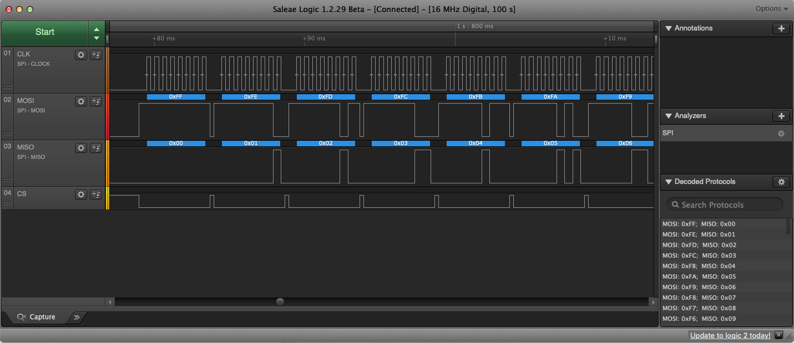

# spi_master and spi_slave

These examples demonstrate using the PL022 hardware SPI module both as master and slave. Each program is meant to be written to its own RP2040 module.

The two modules are meant to be wired together as follows. The RP2040 pin numbers are those on the RP2040 chip itself. The Pico pin numbers are mapped to the pads on the Raspberry Pi Pico board:

| Function | Master pin (RP2040) | Slave pin (RP2040) | Master pin (Pico) | Slave pin (Pico) |
|-|-|-|-|-|
| MOSI | DO0  | DI0  | 25 | 21 |
| SCLK | SCK0 | SCK0 | 24 | 24 |
| GND  | GND  | GND  | 23 | 23 |
| CS   | CS0  | CS0  | 22 | 22 |
| MISO | DI0  | DO0  | 21 | 25 |

You will also want to power the boards and at least watch the master's output using a serial terminal.

It is possible to execute one of the programs without the other, but the master will receive no response, as there is no slave listening. The slave program will initialize, but will neither transmit nor receive anything because there will be no clock pulses.

## Outputs

The slave will be confused if it starts while the master is transmitting. The easiest solution is to stop both, start the slave first, the master second.

The master should output the following:

```
SPI master example
SPI master initialised.
The following buffer will be written to MOSI endlessly.
00 01 02 03 04 05 06 07 08 09 0a 0b 0c 0d 0e 0f
10 11 12 13 14 15 16 17 18 19 1a 1b 1c 1d 1e 1f
20 21 22 23 24 25 26 27 28 29 2a 2b 2c 2d 2e 2f
30 31 32 33 34 35 36 37 38 39 3a 3b 3c 3d 3e 3f
40 41 42 43 44 45 46 47 48 49 4a 4b 4c 4d 4e 4f
50 51 52 53 54 55 56 57 58 59 5a 5b 5c 5d 5e 5f
60 61 62 63 64 65 66 67 68 69 6a 6b 6c 6d 6e 6f
70 71 72 73 74 75 76 77 78 79 7a 7b 7c 7d 7e 7f
80 81 82 83 84 85 86 87 88 89 8a 8b 8c 8d 8e 8f
90 91 92 93 94 95 96 97 98 99 9a 9b 9c 9d 9e 9f
a0 a1 a2 a3 a4 a5 a6 a7 a8 a9 aa ab ac ad ae af
b0 b1 b2 b3 b4 b5 b6 b7 b8 b9 ba bb bc bd be bf
c0 c1 c2 c3 c4 c5 c6 c7 c8 c9 ca cb cc cd ce cf
d0 d1 d2 d3 d4 d5 d6 d7 d8 d9 da db dc dd de df
e0 e1 e2 e3 e4 e5 e6 e7 e8 e9 ea eb ec ed ee ef
f0 f1 f2 f3 f4 f5 f6 f7 f8 f9 fa fb fc fd fe ff
Read the following from MISO, page 0:
ff fe fd fc fb fa f9 f8 f7 f6 f5 f4 f3 f2 f1 f0
ef ee ed ec eb ea e9 e8 e7 e6 e5 e4 e3 e2 e1 e0
df de dd dc db da d9 d8 d7 d6 d5 d4 d3 d2 d1 d0
cf ce cd cc cb ca c9 c8 c7 c6 c5 c4 c3 c2 c1 c0
bf be bd bc bb ba b9 b8 b7 b6 b5 b4 b3 b2 b1 b0
af ae ad ac ab aa a9 a8 a7 a6 a5 a4 a3 a2 a1 a0
9f 9e 9d 9c 9b 9a 99 98 97 96 95 94 93 92 91 90
8f 8e 8d 8c 8b 8a 89 88 87 86 85 84 83 82 81 80
7f 7e 7d 7c 7b 7a 79 78 77 76 75 74 73 72 71 70
6f 6e 6d 6c 6b 6a 69 68 67 66 65 64 63 62 61 60
5f 5e 5d 5c 5b 5a 59 58 57 56 55 54 53 52 51 50
4f 4e 4d 4c 4b 4a 49 48 47 46 45 44 43 42 41 40
3f 3e 3d 3c 3b 3a 39 38 37 36 35 34 33 32 31 30
2f 2e 2d 2c 2b 2a 29 28 27 26 25 24 23 22 21 20
1f 1e 1d 1c 1b 1a 19 18 17 16 15 14 13 12 11 10
0f 0e 0d 0c 0b 0a 09 08 07 06 05 04 03 02 01 00
```

Additional pages follow, all containing the same content.

The slave should output the following:

```
SPI slave example
SPI slave initialised.
When reading from MOSI, the following buffer will be written to MISO:
ff fe fd fc fb fa f9 f8 f7 f6 f5 f4 f3 f2 f1 f0
ef ee ed ec eb ea e9 e8 e7 e6 e5 e4 e3 e2 e1 e0
df de dd dc db da d9 d8 d7 d6 d5 d4 d3 d2 d1 d0
cf ce cd cc cb ca c9 c8 c7 c6 c5 c4 c3 c2 c1 c0
bf be bd bc bb ba b9 b8 b7 b6 b5 b4 b3 b2 b1 b0
af ae ad ac ab aa a9 a8 a7 a6 a5 a4 a3 a2 a1 a0
9f 9e 9d 9c 9b 9a 99 98 97 96 95 94 93 92 91 90
8f 8e 8d 8c 8b 8a 89 88 87 86 85 84 83 82 81 80
7f 7e 7d 7c 7b 7a 79 78 77 76 75 74 73 72 71 70
6f 6e 6d 6c 6b 6a 69 68 67 66 65 64 63 62 61 60
5f 5e 5d 5c 5b 5a 59 58 57 56 55 54 53 52 51 50
4f 4e 4d 4c 4b 4a 49 48 47 46 45 44 43 42 41 40
3f 3e 3d 3c 3b 3a 39 38 37 36 35 34 33 32 31 30
2f 2e 2d 2c 2b 2a 29 28 27 26 25 24 23 22 21 20
1f 1e 1d 1c 1b 1a 19 18 17 16 15 14 13 12 11 10
0f 0e 0d 0c 0b 0a 09 08 07 06 05 04 03 02 01 00
```

The slave doesn't write anything else to the console.

## Electrical signals

The communication looks like this when seen through a logic analyzer.



Original [data file](spi_master_slave.logicdata) is included.
