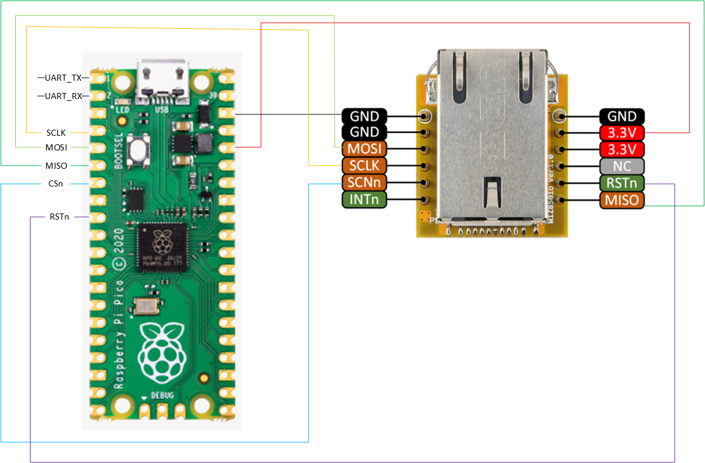

= Attaching a W5500 via SPI

This example code shows how to interface the Raspberry Pi Pico to the WIZ850io(W5500) board. The particular device used can be interfaced via SPI, we are using SPI, and interfacing at 3.3v.

[NOTE]
======
This is a very basic example, and it send and receive data from the WIZ850io(W5500).After you get off the communication command(S"n"_CR) on the WIZ850io, make sure the communication command is clear."n" is socket number.
It is also use the polling approach in the example.
======

== Wiring information

Wiring up the device requires 6 jumpers as follows:

   * GPIO 2 (pin 4) SCK/spi0_sclk -> CLK on IZ850io(W5500) board
   * GPIO 3 (pin 5) MOSI/spi0_tx -> MOSIon IZ850io(W5500) board
   * GPIO 4 (pin 6) MISO/spi0_rx-> MISO on IZ850io(W5500) board
   * GPIO 5 (pin 7) Chip select -> NCS on IZ850io(W5500) board
   * GPIO 6 (pin 9) Reset/GPIO -> Reset on IZ850io(W5500) board
   * 3.3v (pin 36) -> VCC on IZ850io(W5500) board
   * GND (pin 38)  -> GND on IZ850io(W5500) board

The example here uses SPI port 0. Power is supplied from the 3.3V pin.

[NOTE]
======
There are many different manufacturers who sell boards with the WIZ850io(W5500). Whilst they all appear slightly different, they all have, at least, the same 6 pins required to power and communicate. When wiring up a board that is different to the one in the diagram, ensure you connect up as described in the previous paragraph.
======

[[w5500_spi_wiring]]
[pdfwidth=75%]
.Wiring Diagram for WIZ850io(W5500).

== List of Files

CMakeLists.txt:: CMake file to incorporate the example in to the examples build tree.
w5500_spi.c:: The example main code.
loopback.c :: The code provides the loopback code tcp server/ tcp client/ UDP.
socket.c :: socket program like BSP socket.
w5500.c :: The code has register address and register value for w5500
wizchip_conf.c :: The code provides an interface(FSMC / spi) to connect to the MCU.  

== Bill of Materials

.A list of materials required for the example
[[WIZ850io(W5500)-bom-table]]
[cols=3]
|===
| *Item* | *Quantity* | Details
| Breadboard | 1 | generic part
| Raspberry Pi Pico | 1 | http://raspberrypi.org/
| WIZ850io(W5500) board| 1 | https://eshop.wiznet.io/shop/module/wiz850io/
| M/M Jumper wires | 6 | generic part
|===

