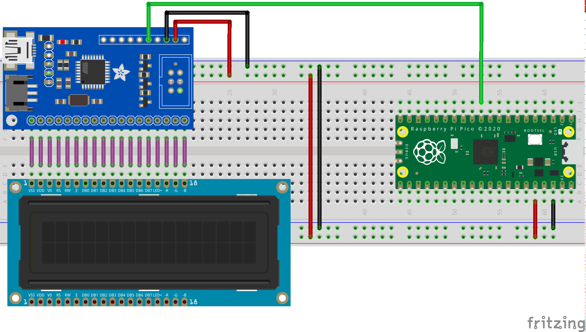

= Attaching a 16x2 LCD via TTL

This example code shows how to interface the Raspberry Pi Pico to one of the very common 16x2 LCD character displays. Due to the large number of pins these displays use, they are commonly used with extra drivers or backpacks. In this example, we will use an Adafruit LCD display backpack, which supports communication over USB or TTL. A monochrome display with an RGB backlight is also used, but the backpack is compatible with monochrome backlight displays too. There is another example that uses I2C to control a 16x2 display.

The backpack processes a set of commands that are documented https://learn.adafruit.com/usb-plus-serial-backpack/command-reference[here] and preceded by the "special" byte 0xFE. The backpack does the ASCII character conversion and even supports custom character creation. In this example, we use the Pico's primary UART (uart0) to read characters from our computer and send them via the other UART (uart1) to print them onto the LCD. We also define a special startup sequence and vary the display's backlight color.

NOTE: You can change where stdio output goes (Pico's USB, uart0 or both) with CMake directives. The CMakeLists.txt file shows how to enable both.

== Wiring information

Wiring up the backpack to the Pico requires 3 jumpers, to connect VCC (3.3v), GND, TX. The example here uses both of the Pico's UARTs, one (uart0) for stdio and the other (uart1) for communication with the backpack. Pin 8 is used as the TX pin. Power is supplied from the 3.3V pin. To connect the backpack to the display, it is common practice to solder it onto the back of the display, or during the prototyping stage to use the same parallel lanes on a breadboard.

NOTE: While this display will work at 3.3V, it will be quite dim. Using a 5V source will make it brighter.

[[lcd_uart_wiring]]
[pdfwidth=75%]
.Wiring Diagram for LCD with TTL backpack.

== List of Files

CMakeLists.txt:: CMake file to incorporate the example in to the examples build tree.
lcd_uart.c:: The example code.

== Bill of Materials

.A list of materials required for the example
[[lcd_uart-bom-table]]
[cols=3]
|===
| *Item* | *Quantity* | Details
| Breadboard | 1 | generic part
| Raspberry Pi Pico | 1 | https://www.raspberrypi.com/products/raspberry-pi-pico/
| 16x2 RGB LCD panel 3.3v | 1 | generic part, https://www.adafruit.com/product/398[available on Adafruit]
| 16x2 LCD backpack | 1 | https://www.adafruit.com/product/781[from Adafruit]
| M/M Jumper wires | 3 | generic part
|===

